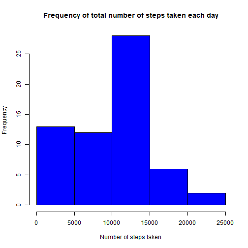
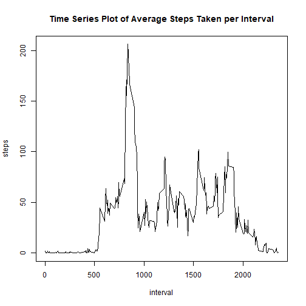
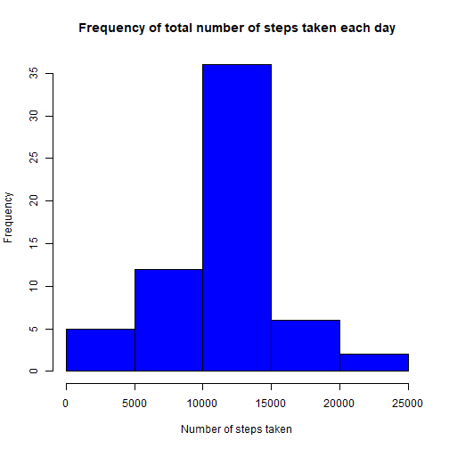
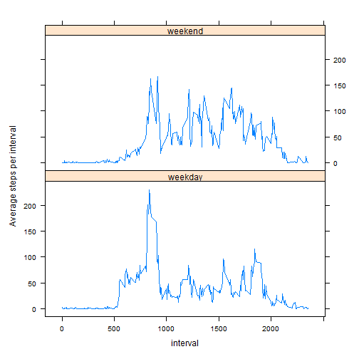

## Loading and preprocessing the data

```r
setwd("D:/Course 1/datasciencecoursera/ProgrammingAssignment1")
unzip("repdata_data_activity.zip")
activity<-read.csv("activity.csv", colClasses=c("numeric", "Date", "numeric"))
```

### Exploring the basics of the dat

```r
head(activity)
```

```
##   steps       date interval
## 1    NA 2012-10-01        0
## 2    NA 2012-10-01        5
## 3    NA 2012-10-01       10
## 4    NA 2012-10-01       15
## 5    NA 2012-10-01       20
## 6    NA 2012-10-01       25
```

```r
str(activity)
```

```
## 'data.frame':	17568 obs. of  3 variables:
##  $ steps   : num  NA NA NA NA NA NA NA NA NA NA ...
##  $ date    : Date, format: "2012-10-01" "2012-10-01" ...
##  $ interval: num  0 5 10 15 20 25 30 35 40 45 ...
```

```r
mean(is.na(activity$steps))
```

```
## [1] 0.1311475
```

## What is mean total number of steps taken per day?

###  1. Calculate the total number of steps per day


```r
stepsperday<-aggregate(activity$steps,by=list(activity$date), sum, na.rm=TRUE)
names(stepsperday)=c("Date", "steps")
```

### 2. Make a histogram of the total number of steps taken each day

```r
hist(stepsperday$steps, xlab="Number of steps taken", main="Frequency of total number of steps taken each day", col="blue")
```



### 3.Calculate and report the mean and median of the total number of steps taken per day

```r
meanperday<-round(mean(stepsperday$steps),0)
medianperday<-round(median(stepsperday$steps),0)
```
Therefore the mean value calculated is 9354, and the median value 1.0395 &times; 10<sup>4</sup>.

## What is the average daily activity pattern?

### 1. Make a time series plot (i.e. 𝚝𝚢𝚙𝚎 = “𝚕”) of the 5-minute interval (x-axis) and the average number of steps taken, averaged across all days (y-axis)

```r
StepsPerInterval<-aggregate(steps~interval, data=activity, mean, na.rm=TRUE)
plot(steps~interval, data=StepsPerInterval, type="l", main="Time Series Plot of Average Steps Taken per Interval")
```



### 2. Which 5-minute interval, on average across all the days in the dataset, contains the maximum number of steps?

```r
max_steps_interval<-StepsPerInterval[which.max(StepsPerInterval$steps), ]$interval
```
835 contain the maximum number of steps on average across all the days in the dataset.

## Imputing missing values

### 1.Calculate and report the total number of missing values in the dataset 

```r
NA_steps<-sum(is.na(activity$steps))
```
Total number of missing values in the dataset is 2304.

### 2. Devise a strategy for filling in all of the missing values in the dataset.
I fill in all the missing values in the dataset with the mean for the 5-minute interval.

```r
NA_value<-function(interval){
  StepsPerInterval[StepsPerInterval$interval==interval,]$steps
}
```

### 3.Create a new dataset that is equal to the original dataset but with the missing data filled in with the mean for 5-minute interval.

```r
activityNoNA<-activity
for(i in 1:nrow(activity)){
  if(is.na(activity[i,]$steps)){
    activityNoNA[i,]$steps<-NA_value(activityNoNA[i,]$interval)
  }
}
```

### 4. Make a histogram of the total number of steps taken each day and Calculate and report the mean and median total number of steps taken per day. 

```r
StepsPerDayNoNA<-aggregate(steps~date, data=activityNoNA, sum)
hist(StepsPerDayNoNA$steps, xlab="Number of steps taken", main="Frequency of total number of steps taken each day", col="blue")
```



```r
meanperdayNoNA<-round(mean(StepsPerDayNoNA$steps),0)
mediaperdayNoNA<-round(median(StepsPerDayNoNA$steps),0)
```
Mean and Median of the total number of steps taken per day is 1.0766 &times; 10<sup>4</sup> and 1.0766 &times; 10<sup>4</sup>.

## Are there differences in activity patterns between weekdays and weekends?

### 1. Create a new factor variable in the dataset with two levels – “weekday” and “weekend” indicating whether a given date is a weekday or weekend day.

```r
activityNoNA$day<-weekdays(activityNoNA$date)
for(i in 1:nrow(activityNoNA)){
  if(activityNoNA[i,]$day %in% c("Saturday", "Sunday")){
    activityNoNA[i,]$day<-"weekend"
  }
    else{
      activityNoNA[i,]$day<-"weekday"
    }
}
```

### 2. Make a panel plot containing a time series plot (i.e. type = "l") of the 5-minute interval (x-axis) and the average number of steps taken, averaged across all weekday days or weekend days (y-axis).

```r
AverageStepsPerDay<-aggregate(steps~day+interval, data=activityNoNA,mean)
library(lattice)
xyplot(steps~interval|day, AverageStepsPerDay, type="l", layout=c(1,2), ylab="Average steps per interval")
```




